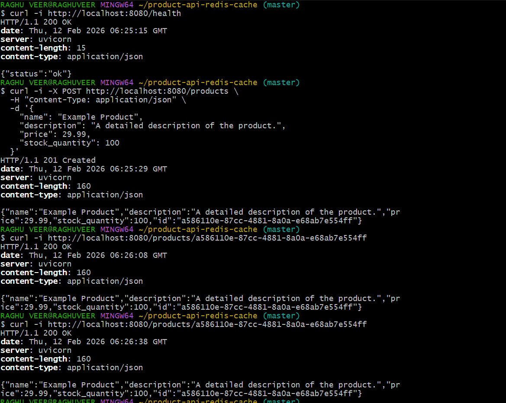
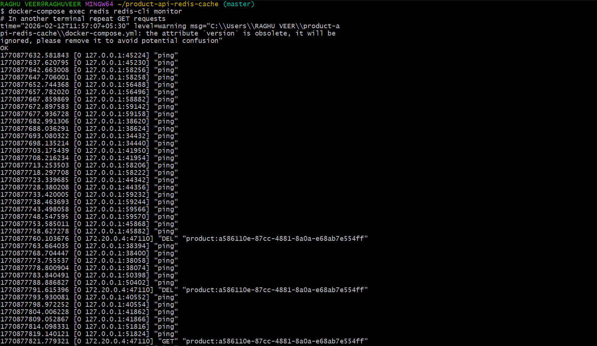

# Product API with Redis Caching

Backend API for managing a product catalog using a Redis cache-aside strategy with proper cache invalidation on writes. Built with FastAPI, PostgreSQL, Redis, Docker, and pytest.

## Table of Contents

- [Features](#features)
- [Architecture Overview](#architecture-overview)
- [Tech Stack](#tech-stack)
- [Getting Started](#getting-started)
  - [Prerequisites](#prerequisites)
  - [Setup](#setup)
  - [Running the Stack](#running-the-stack)
  - [Healthcheck](#healthcheck)
- [API Documentation](#api-documentation)
  - [Create Product - POST /products](#create-product---post-products)
  - [Get Product by ID - GET /productsid](#get-product-by-id---get-productsid)
  - [Update Product by ID - put-productsid](#update-product-by-id---put-productsid)
  - [Delete Product by ID - delete-productsid](#delete-product-by-id---delete-productsid)
- [Caching Strategy](#caching-strategy)
- [Database Seeding](#database-seeding)
- [Configuration & Environment Variables](#configuration--environment-variables)
- [Docker & Docker Compose](#docker--docker-compose)
- [Automated Tests](#automated-tests)
- [Screenshots](#screenshots)
- [Video Demo](#video-demo)
- [Design Decisions](#design-decisions)
- [How to Demonstrate Cache Hit/Miss](#how-to-demonstrate-cache-hitmiss)
- [Future Improvements](#future-improvements)

---

## Features

- RESTful product CRUD API (`/products`) with clear status codes (200, 201, 204, 400, 404, 500).[web:17][web:19]
- Cache-aside pattern with Redis for `GET /products/{id}` to reduce database load and improve latency.[web:3][web:15]
- Cache invalidation on `POST`, `PUT`, and `DELETE` to avoid stale data.
- Configurable cache TTL via environment variable.
- Graceful fallback to the database if Redis is unavailable.
- Automatic database seeding with sample products on startup.
- Fully containerized stack (API, PostgreSQL, Redis) managed via Docker Compose.
- Automated unit and integration tests, including cache hit/miss/invalidation scenarios.

---

## Architecture Overview

- **FastAPI** provides the HTTP layer with typed request/response models.
- **PostgreSQL** stores product data as the primary source of truth.
- **Redis** acts as a distributed in-memory cache using cache-aside strategy.
- **SQLAlchemy** handles ORM mapping and DB sessions.
- **Docker Compose** orchestrates all services in a single command.

---

## Tech Stack

- **Language:** Python 3.11
- **Framework:** FastAPI
- **Database:** PostgreSQL
- **Cache:** Redis
- **ORM:** SQLAlchemy
- **Tests:** pytest + httpx + redis-py
- **Containerization:** Docker & Docker Compose

---

## Getting Started

### Prerequisites

- Docker
- Docker Compose
- Git

### Setup

```bash
git clone https://github.com/<your-username>/product-api-redis-cache.git
cd product-api-redis-cache
cp .env.example .env
```

You can adjust environment values in `.env` if needed.

### Running the Stack

Build and start all services:

```bash
docker-compose up --build -d
```

Services:

- API: `http://localhost:8080`
- PostgreSQL: `localhost:5432`
- Redis: `localhost:6379`

Check container status:

```bash
docker-compose ps
```

### Healthcheck

```bash
curl -i http://localhost:8080/health
```

Expected response:

```json
{"status":"ok"}
```

---

## API Documentation

All responses are JSON. The API is stateless and uses standard HTTP methods and status codes.[web:17][web:19]

### Create Product - `POST /products`

**Request**

```http
POST /products
Content-Type: application/json
```

Body:

```json
{
  "name": "Example Product",
  "description": "A detailed description of the product.",
  "price": 29.99,
  "stock_quantity": 100
}
```

**Responses**

- `201 Created` with created product:

```json
{
  "id": "<generated-uuid>",
  "name": "Example Product",
  "description": "A detailed description of the product.",
  "price": 29.99,
  "stock_quantity": 100
}
```

- `400 Bad Request` for validation errors.

### Get Product by ID - `GET /products/{id}`

**Request**

```http
GET /products/{id}
```

**Responses**

- `200 OK` with product JSON:

```json
{
  "id": "<product-id>",
  "name": "Example Product",
  "description": "A detailed description of the product.",
  "price": 29.99,
  "stock_quantity": 100
}
```

- `404 Not Found` if product does not exist.

Caching details:

- On first request: cache miss → load from DB → store in Redis with TTL (cache-aside).
- On subsequent requests within TTL: cache hit → served from Redis.[web:3][web:4]

### Update Product by ID - `PUT /products/{id}`

**Request**

```http
PUT /products/{id}
Content-Type: application/json
```

Body (partial or full):

```json
{
  "price": 34.99,
  "stock_quantity": 95
}
```

**Responses**

- `200 OK` with updated product:

```json
{
  "id": "<product-id>",
  "name": "Example Product",
  "description": "A detailed description of the product.",
  "price": 34.99,
  "stock_quantity": 95
}
```

- `400 Bad Request` if request body is empty.
- `404 Not Found` if product does not exist.

Successful updates invalidate the corresponding Redis cache entry so the next `GET` will fetch from DB, then recache.

### Delete Product by ID - `DELETE /products/{id}`

**Request**

```http
DELETE /products/{id}
```

**Responses**

- `204 No Content` on successful deletion.
- `404 Not Found` if product does not exist.

Successful deletion invalidates the corresponding Redis cache entry. After that, `GET /products/{id}` returns `404 Not Found`.

---

## Caching Strategy

**Pattern:** Cache-aside (lazy loading).[web:3][web:15]

- **Read (`GET /products/{id}`)**:
  1. Application checks Redis with key `product:{id}`.
  2. If key exists (cache hit), data is returned from Redis.
  3. If key does not exist (cache miss), data is loaded from PostgreSQL, then written to Redis (`SETEX`) with configured TTL.

- **Write (`POST /products`, `PUT /products/{id}`, `DELETE /products/{id}`)**:
  - Always write to PostgreSQL first.
  - On successful write/delete, invalidates (`DEL`) `product:{id}` in Redis.

**TTL Management**

- `CACHE_TTL_SECONDS` controls the time-to-live for product entries (default: 3600 seconds).
- After TTL expires, the next `GET` is a cache miss, causing a DB read and a fresh cache set.

**Redis Failure Handling**

- If Redis is unavailable, the API logs the failure (or swallows in this minimal example) and continues to fetch data directly from PostgreSQL, ensuring high availability.

---

## Database Seeding

On application startup:

- Tables are created using SQLAlchemy metadata.
- If the `products` table is empty, 3 sample products are inserted (e.g., “Sample Product A/B/C”) to simplify testing and demos.

---

## Configuration & Environment Variables

All configuration is driven by environment variables (no hardcoding of secrets).

From `.env.example`:

```env
API_PORT=8080
DATABASE_URL=postgresql+psycopg2://postgres:postgres@db:5432/productdb
REDIS_HOST=redis
REDIS_PORT=6379
CACHE_TTL_SECONDS=3600
```

- `API_PORT`: Port where FastAPI listens inside container (mapped to host via Docker Compose).
- `DATABASE_URL`: Connection string for PostgreSQL.
- `REDIS_HOST` / `REDIS_PORT`: Redis connection info.
- `CACHE_TTL_SECONDS`: Default TTL for cached product entries.

---

## Docker & Docker Compose

The stack is defined in `docker-compose.yml`:

- `api-service`: FastAPI app.
- `db`: PostgreSQL.
- `redis`: Redis cache.

To rebuild and restart:

```bash
docker-compose down
docker-compose up --build -d
```

---

## Automated Tests

Tests run inside the `api-service` container.

**Command (used by evaluators):**

```bash
docker-compose exec api-service pytest tests/
```

Test coverage:

- **Unit tests** (`tests/unit`):
  - Product service functions (create, get, update, delete) against the DB, ensuring core business logic works.
- **Integration tests** (`tests/integration`):
  - `POST /products` followed by `GET /products/{id}` → verifies basic CRUD.
  - Cache miss then hit behavior by inspecting Redis keys.
  - Cache invalidation on `PUT` and `DELETE`, including final `404` after delete.

---

## Screenshots

1. **Postman/Insomnia – Create Product**

   

2. **Redis MONITOR – Cache Activity**

   


---

## Video Demo
-https://<your-video-link>


---

## Design Decisions

- **Cache-aside** pattern chosen for simplicity and clear separation of concerns between DB and cache.[web:3][web:15]
- **Single-resource caching** (`GET /products/{id}`) since the task focuses on item-level caching, not list/pagination caching.
- **FastAPI** due to async capability and excellent support for typed request/response models.[web:4]
- **PostgreSQL** for reliable transactional storage and easy Docker integration.
- **Redis** for low-latency cached reads and TTL-based eviction.

